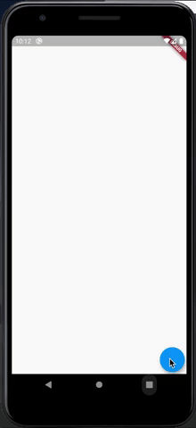

# Arc Animator

A flutter package to animate a widget on a circular path (arc)

## Getting Started




You need a basic understanding of Flutter animation to follow along.

```dart
 @override
  void initState() {
    controller = AnimationController(
        vsync: this, duration: Duration(milliseconds: 600));
    super.initState();
  }

  @override
  Widget build(BuildContext context) {
  
    final size = MediaQuery.of(context).size;
    
    return Material(
      child: Stack(
        children: [
          ArcAnimator(
            curve: Curves.easeInOutSine,
            begin: Offset(60, 60),
            end: Offset(size.width - 60, size.height - 60),
            controller: controller,
            statusListener: (status) => print(status),
            offsetChanging: (offset) => print(offset),
            child: FloatingActionButton(
              onPressed: () => controller.forward(), // You don't need controller.reverse()
            ),
          )
        ],
      ),
    );
  }
```
